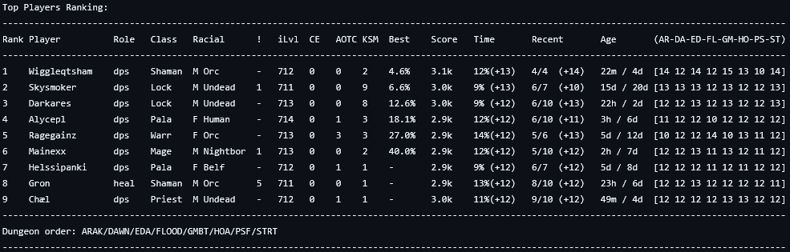

This is a personal script to look up and rank every applicant for my WoW dungeon- or raid groups.
A json of each applicant (generated via the Raider.io addon) is manually copy-pasted into the "input.json" file, and each player profile will then be looked up on raider.io.

Rankings include Player name, Role, Class, missing enchant/gem counter, iLvl, CE/AOTC achievement count, KSM count, Best run, m+ Score, completion timers, recent runs, and Age (time since last run). There are also a score breakdown for each dungeon.

See the below image for an example of what the output will look like.

